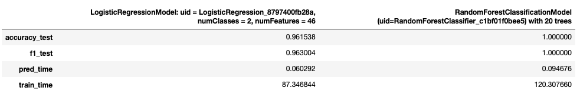

### Table of Contents

1. [Installation](#installation)
2. [Project Motivation](#motivation)
3. [Project structure & file description](#files)
4. [Results](#results)
5. [References](#refs)


## Installation <a name="installation"></a>

 - Python 3x
 - NumPy
 - Pandas
 - Seaborn
 - Matplotlib
 - PySpark SQL
 - PySpark ML

 

## Project Motivation <a name="motivation"></a>

For this project, we were given the opportunity to work on a real case of challenging problem, many user-facing 
organisation have to cope with.
Being capable to identify and predict potential churn users can be a game changer for many companies, in developing
incentives to retain as possible such users.

Along the project we will:
- work on a dataset (128MB) provided by Udacity in collaboration with Sparkify
- clean & manipulate the data using PySpark
- Conduct data analysis to explore our dataset and understand valuable features to extract into our predictive model
- Feature engineering. Transforming variables of interest into usable assets for our models.
- Modeling using best suited ML algorithm for our problem/use case.

## Project structure & file description <a name="files"></a>

```
nd-capestone
├── readme.md
├── mini_sparkify_event_data.json (file not uploaded reaching max size limit)
│── Sparkify.ipynb
│── Sparkify.html
```

## Results<a name="results"></a>

The main findings of the project can be found in the post available [here](https://medium.com/@sbencherif22/to-churn-or-not-to-churn-that-is-the-question-4cde9b7525bb)

Summary of models resuls in table below:


## References<a name="refs"></a>
- Datasets provided by Udacity in collaboration with Sparkify. 
- Kudos to Udacity's mentors & students for their support and contribution along the project.
- https://en.wikipedia.org/wiki/Statistical_classification
- https://machinelearningmastery.com/classification-versus-regression-in-machine-learning/#:~:text=A%20classification%20problem%20requires%20that,class%20or%20binary%20classification%20problem.
- https://machinelearningmastery.com/types-of-classification-in-machine-learning/
- https://en.wikipedia.org/wiki/Binary_classification
- https://en.wikipedia.org/wiki/Logistic_regression
- https://en.wikipedia.org/wiki/Random_forest
- https://www.analyticsvidhya.com/blog/2021/06/understanding-random-forest/
- https://www.analyticsvidhya.com/blog/2021/07/metrics-to-evaluate-your-classification-model-to-take-the-right-decisions/
- https://machinelearningmastery.com/what-is-imbalanced-classification/#:~:text=Imbalanced%20classification%20refers%20to%20a,is%20instead%20biased%20or%20skewed
- https://medium.com/analytics-vidhya/accuracy-vs-f1-score-6258237beca2
- https://spark.apache.org/docs/latest/ml-tuning.html