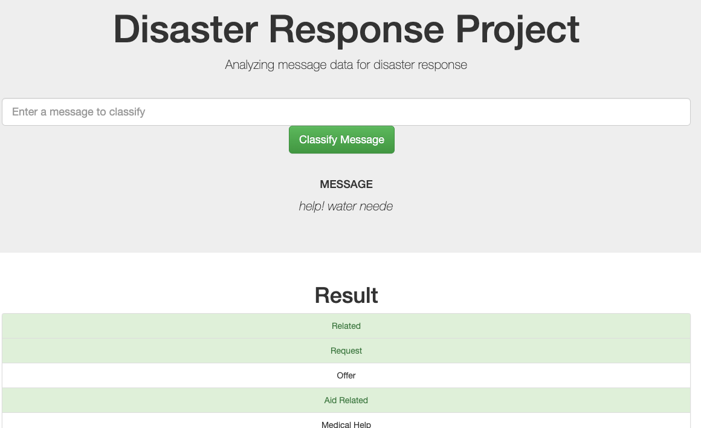
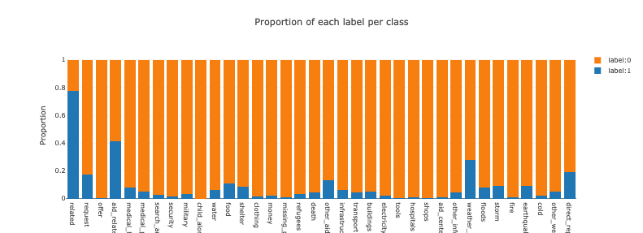

### Table of Contents

1. [Installation](#installation)
2. [Project Motivation](#motivation)
3. [Project structure & file description](#files)
4. [Run the app](#run)
5. [Model results](#results)
6. [Authorization & licence](#copyright)

## Installation <a name="installation"></a>

The code should run with no issues using Python versions 3.*.

## Project Motivation<a name="motivation"></a>

Along the project, we had the opportunity to positively contribute to communities in need for help.
Indeed, being provided with [Appen] (https://appen.com/) data, we had access to thousands of text messages sent during disaster events by real persons.
Main purpose of the project is to deliver an ML model that will be consumed by an API used to classify messages.
The project will be made of three main components


1. web app accessible to emergency workers where they can input text message and get a classification for it into several categories.
2. ETL pipeline responsible for pulling text messages data from a given source and wrangle it to best fit our ML model requirements 
3. machine learning pipeline that consists in several steps carried out to build a robust and optimized ML model used to categorize text messages

## Project structure & file description <a name="files"></a>

```
nd-disaster-pipeline
├── app 
│   │── templates
│       │── go.html
│       │── master.html
│   │── run.py
│── data
│   │── disaster_categories.csv
│   │── disaster_messages.csv
│   │── process_data.py
│   │── project_disaster.db
├── exploration
├── models
│   │── train_classifier.py
├── readme

```

Project is made of 2 main folders:
- `app` contains the Flask web app code.

- `data` contains the source files(2) used in our ELT/ ML pipelines and the script processing and preparing the data used in our model.

- `models` contains the script building and optimizing our model.

- `requirements.txt` at the root of project, contains the packages to be installed to run the notebook.

- `readme.md` at the root of project, describes the structure of the project.

## How to run the application<a name="run"></a>

Instructions of How to Interact With Project:
Run the following commands in the project's root directory to set up your database and model.
-From project root directory, execute the following commands in terminal:
- ETL pipeline `python data/process_data.py data/disaster_messages.csv data/disaster_categories.csv data/project_disaster.db`
- ML pipeline `models/train_classifier.py data/project_disaster.db models/classifier_rfc.pkl`

From the app directory,execute the following commands in terminal:
- Run the web app with `python run.py`
- In browser, go to http://localhost:3001/



## Model results<a name="results"></a>

From the first version of our tuned model, it turns out our classification predictive model is scoring relatively high on accuracy for most of the categories(class)
we are trying to predict.
Even though it could be a desired outcome, it probably isn't in our case, given the score of other performance metrics - see classification report in model evaluation. 
Also, by simply ploting the label distribution for each class, one can see we are dealing with an imbalanced class distribution challenge, that would require further tuning in our model.


## Authorization & licence<a name="copyright"></a>
Web app code templates designed and provided to be used for learning purpose by Udacity.
Datasets are also provided by Udacity in collaboration with Appen.


